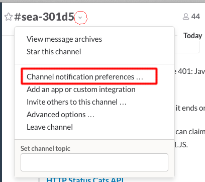
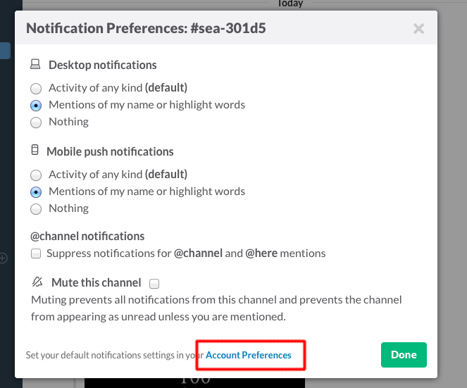
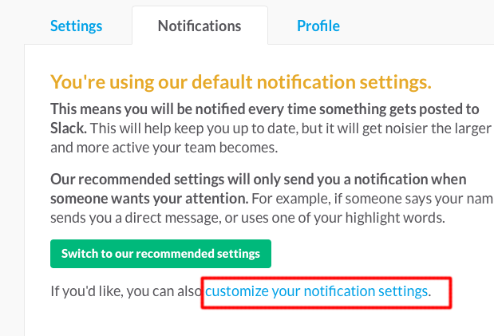
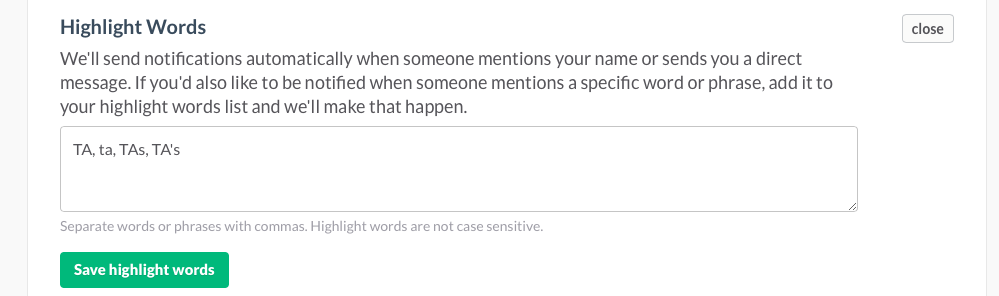

# How to use highlight words on slack to notify TA's

* Open the menu in slack, click "Channel notification preferences..."

* Set your notification preferences. Click "Account Preferences"

* Make sure you're on the "Notifications" tab. Click "customize your notification settings"

* Scroll down to find "Highlight Words". Add your words. They're not case sensitive, but I didn't see that before I made this.

